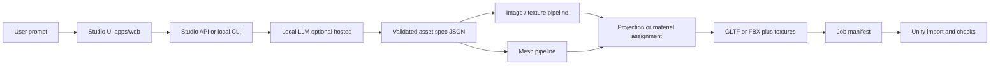

# Architecture

## High-level data flow

## Monorepo layout

| Path | Role |
|------|------|
| `apps/web` | `@immersive/web` — Vite + React site; future **Studio UI** (job queue, prompts, previews) can grow here or under `apps/web/src/studio/`. |
| `packages/studio-types` | `@immersive/studio-types` — shared TypeScript types for specs and manifests. |
| `docs/studio/` | Planning and conventions (this folder). |
| `apps/studio-worker` | Python package `immersive-studio-worker`: Ollama/mock spec generation, JSON Schema validation, pack writer, FastAPI for `/studio`, Blender stub script. |
| `packages/studio-unity` | UPM package `com.immersivelabs.studio`: Editor import wizard (textures → URP Lit materials). |

Adding `apps/studio-worker` is deferred until implementation; the docs describe its responsibilities now so the first commit is not a blank slate.

## Components

### 1. Studio UI (`@immersive/web`)

- Collects user intent, shows style preset and asset category.
- Displays job status, logs, and download links for generated packs.
- Does **not** need to run Blender; it talks to the worker API or watches an output folder in local-dev mode.

### 2. Spec compiler (LLM + validator)

- **Input:** natural language + selected `style_preset` and `category`.
- **Output:** `StudioAssetSpec` / batch JSON matching [json-schema-spec.md](./json-schema-spec.md).
- **Validator:** schema validation + business rules (poly budget bounds, allowed collider types, required material slots per style).

### 3. Image / texture pipeline

- **ComfyUI** (or equivalent) with **versioned graphs** per style preset.
- Produces PBR-friendly maps where possible: base color, normal, ORM (occlusion/roughness/metallic) or separate maps per Unity convention.
- **Realistic HD** may use higher resolutions and more graph steps; **toon/anime** may bias toward cleaner albedo and simplified ORM.

### 4. Mesh pipeline

- **Phase 1 (recommended):** procedural primitives + kitbash + Blender for boolean/bevel/unwrap/export — most predictable.
- **Phase 2+:** optional local text/image-to-3D, always followed by **automated cleanup** (decimate, unwrap repair, origin/scale normalization).

### 5. Export and manifest

- Writes a directory tree per [unity-export-conventions.md](./unity-export-conventions.md).
- Embeds [job manifest](./json-schema-spec.md) with toolchain versions and seeds.

### 6. Unity validation

- Scripted checks: missing textures, scale, collider presence, triangle count vs spec.
- Material assignment from preset templates.

## Deployment models

- **Local dev (default):** UI + worker on same machine; ComfyUI and Blender invoked locally; no cloud required.
- **Optional LAN:** worker binds to localhost or LAN for a single-team setup.
- **Static site + API split:** The Vite app (`apps/web`) can be deployed to **Vercel**, **Netlify**, **Cloudflare Pages**, or any static host. That host does **not** run the worker or store SQLite — set `VITE_STUDIO_API_URL` to your worker’s public URL. The worker runs on a **VM, container, or bare metal** where `output/*.sqlite` and `output/jobs/` live on a **persistent disk** (serverless functions cannot replace the worker without architectural changes).
- **Horizontal scale (optional):** Multiple API replicas can set **`DATABASE_URL`** plus **`STUDIO_TENANTS_BACKEND=postgres`**, **`STUDIO_QUEUE_BACKEND=postgres`** (DB polling + `SKIP LOCKED`), **`STUDIO_QUEUE_BACKEND=redis`** (managed Redis: **`STUDIO_REDIS_QUEUE_ENGINE=zset`** or **`streams`** / `XREADGROUP`), or **`STUDIO_QUEUE_BACKEND=sqs`** (SQS long-poll + Postgres for queue rows). Use **`STUDIO_JOB_ARTIFACTS`** (`s3` / `r2` / `vercel_blob`) for remote zips. Details: [essentials.md](./essentials.md) §1b and [apps/studio-worker/README.md](../../apps/studio-worker/README.md).
- **Cloudflare edge (Workers, R2, D1, KV):** the Python worker stays on a compute host for Blender/Comfy/long jobs; R2 is already supported for artifacts; Workers/KV/D1 fit a **gateway + cache + new edge-only** layer — see [cloudflare-edge-and-storage.md](./cloudflare-edge-and-storage.md).

## Technology choices (defaults)

| Concern | Default | Rationale |
|---------|---------|-----------|
| Web app | Existing Vite + React | Already in repo; fast UI iteration. |
| Worker language | **Python** (first choice) | Best Blender automation story; rich ML ecosystem. |
| LLM (local) | Ollama or llama.cpp compatible | No API key; runs on workstation. |
| Textures | ComfyUI + open weights | Local GPU; reproducible graphs. |
| Mesh cleanup | Blender batch mode | Industry-standard exporters and UV tools. |
| Interchange | **glTF 2.0** primary | Unity imports well; human-readable sidecar JSON. |

These are defaults, not permanent locks; the manifest must record what was actually used.
